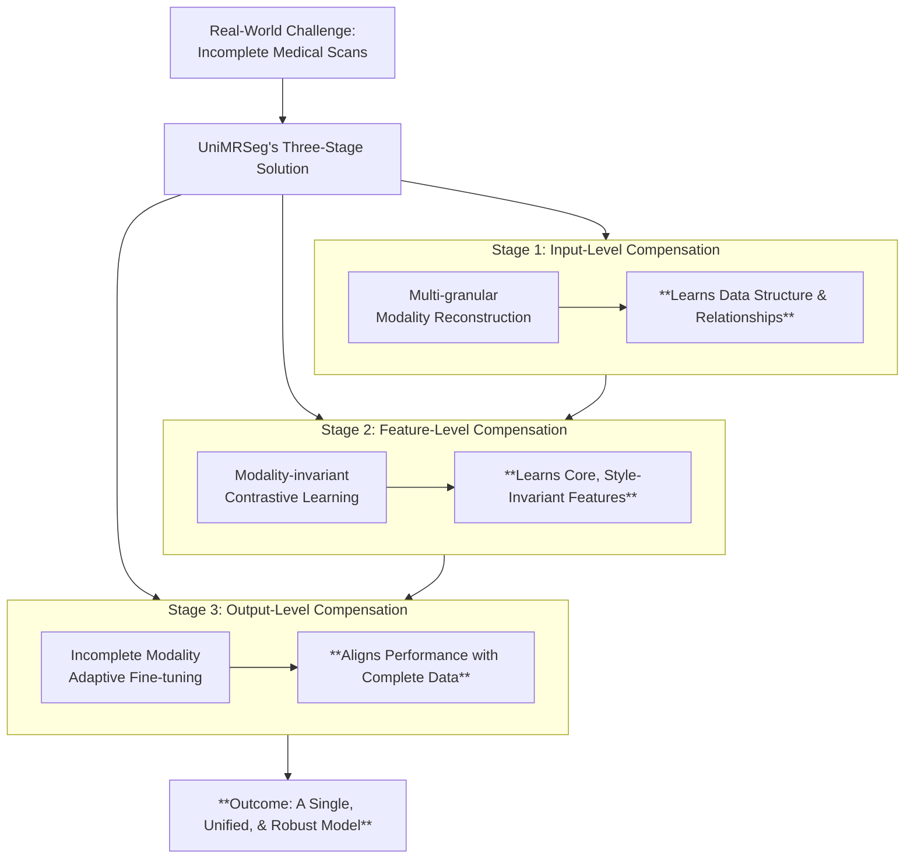

# Understanding UniMRSeg: A Step-by-Step Guide to its Three-Stage Learning Framework

## Introduction: The Challenge of Missing Puzzle Pieces in Medical Imaging

Imagine a doctor trying to understand a patient's brain tumor. To get the most complete picture, they ideally use several different types of MRI scans—like Flair, T1, T1ce, and T2. Each scan is like a unique piece of a puzzle, revealing different details about the tumor's size, shape, and composition. When all the puzzle pieces are present, the doctor (and an AI model) can see the full picture with clarity.

However, in the real world of medicine, things are often imperfect. Due to clinical constraints, patient conditions, or sensor issues, one or more of these crucial scans might be missing. This **"incomplete modality" problem** is like trying to solve the puzzle with several pieces gone. For a standard AI model, this missing information can be deeply confusing, often leading to poor and unreliable performance when it's needed most.

This is precisely the challenge that **UniMRSeg** is designed to solve. It is a specialized framework built to perform medical image segmentation effectively, even with these missing puzzle pieces. Its "magic" isn't a single trick, but a carefully designed, **three-stage training process** that teaches the model how to intelligently compensate for missing information and deliver consistent, high-quality results.

The brilliance of UniMRSeg lies in its core strategy: **Hierarchical Self-Supervised Compensation**. Instead of a single fix, it systematically addresses the "missing puzzle piece" problem at every level of the network. It first learns to compensate at the raw input level, then at the level of its internal features, and finally at the final output level. This hierarchical approach ensures that the model builds a deeply robust understanding from the ground up.

To understand how it works, we'll walk through its educational journey, stage by stage:

> **The Three-Stage Journey:**
> 1. **Stage 1:** Multi-granular Modality Reconstruction
> 2. **Stage 2:** Modality-invariant Contrastive Learning
> 3. **Stage 3:** Incomplete Modality Adaptive Fine-tuning

---

## Stage 1: Learning to Fill in the Blanks (Multi-granular Modality Reconstruction)

###  Goal
To teach the model the fundamental **relationships between different modalities (scans)**. It's a "pretext task" where the model learns to **reconstruct** missing scans based on available ones, building an intrinsic understanding of data structure.

###  How It Learns: The "Hybrid Shuffled-Masking" Training Regime
The model undergoes exercises that disrupt data at multiple scales (global & local).

| Exercise | Description | Analogy & Purpose |
| :--- | :--- | :--- |
| **Modality Dropout** | Randomly removes entire scan types. | **Removing puzzle pieces.** Forces the model to infer the full picture from partial data. |
| **Modality Shuffle** | Randomly changes the order of input scans. | **Shuffling the puzzle box.** Prevents reliance on fixed order, forcing recognition of each scan's unique content. |
| **Spatial Masking** | Hides random patches within available images. | **Putting sticky notes on a photo.** Forces the model to infer missing local details from context and other scans. |

###  So What? (The Outcome)
The model gains a **robust understanding of anatomical structure and inter-modality relationships**. Like a reader inferring missing pages from context, it can now generate meaningful representations for any missing modality.

**➡️ Next:** With the ability to guess what's missing, the model now learns to focus on the *most important content*.

---

## Stage 2: Focusing on What Matters (Modality-invariant Contrastive Learning)

###  Goal
To teach the model to create a **similar internal representation** of an object (e.g., a tumor) **regardless of which scan type it appears in**. It learns **"modality-invariant" features**—the essence of the object, not the superficial "style" of the scan.

### How It Learns: Contrastive Learning with Segmentation Guidance
The model learns by comparing pairs of feature representations.

| Pair Type | Description | Learning Objective |
| :--- | :--- | :--- |
| **Positive Pair**  | Features from the **same patient image**—one from complete data, one from incomplete data. | *"These represent the same object. Pull them together."* |
| **Negative Pair**  | Features from **two different patient images**. | *"These are different objects. Push them apart."* |

**+ Segmentation Constraint:** While learning these features, the model is simultaneously guided by the final segmentation task. This ensures the learned features are directly useful for its ultimate goal.

###  So What? (The Outcome)
The model learns to **implicitly compensate for feature biases** caused by missing scans. It focuses on the **"substance"** (the tumor) rather than the **"style"** (the modality), building a robust, core understanding of the target anatomy.

**Next:** With a robust core understanding, the model undergoes final refinement for peak accuracy.

---

## Stage 3: The Final Polish (Incomplete Modality Adaptive Fine-tuning)

### Goal
To **perfect performance on incomplete data** by using predictions from complete data (the **"teacher"**) to guide predictions from incomplete data (the **"student"**). This stage provides **explicit compensation** to fix specific errors.

> **Key Design:** The model's core encoder is **frozen** here. Only specialized, lightweight components are tuned.

###  How It Learns: Two Key Mechanisms
#### 1. The Specialist Helper: **Reverse Attention Adapter**
A small adapter module is added to pinpoint and fix **"weak perceptual semantics"**—the blind spots that appear when data is missing.
- **Process:** Calculates a mutual attention map (areas of agreement), applies a *reverse* to highlight **areas of disagreement**, then focuses compensation there.
- **Analogy:** A specialist apprentice performing delicate touch-ups without disturbing the master's core work.

#### 2. Learning from the Teacher: **Hybrid Consistency Constraints**
The "student" (incomplete data path) is forced to match the "teacher" (complete data path) at two levels. This is repeated for all possible incomplete scenarios (e.g., 14 combinations for 4 modalities).

| Constraint Level | What is Matched | Analogy |
| :--- | :--- | :--- |
| **Feature-level** | The model's internal feature maps. | Learning to **think** like the expert. |
| **Prediction-level** | The final segmentation outline. | Producing the same **expert result**. |

###  So What? (The Outcome)
This stage **closes the final performance gap**. It ensures the model's predictions are **stable and reliable** for any combination of available modalities, making it production-ready for real-world, messy data.

---

## Conclusion: A Three-Step Journey to Robust Segmentation

UniMRSeg's strength lies in its **hierarchical learning framework**, which systematically builds robustness by compensating for missing information at every level of processing.



### The Hierarchical Compensation Strategy Summarized:

| Step | Level of Compensation | Core Learning | Outcome |
| :--- | :--- | :--- | :--- |
| **1. Stage 1** | **Input Level** | Reconstructs missing data; understands inter-modality structure. | Builds a **foundational knowledge base**. |
| **2. Stage 2** | **Feature Level** | Creates consistent internal representations focused on content, not modality style. | Develops a **robust, core understanding** of anatomy. |
| **3. Stage 3** | **Output Level** | Uses a "teacher" model and a specialist adapter to correct weak spots and align predictions. | Achieves **reliable, high-accuracy segmentation** for any input combination. |

**Ultimately, UniMRSeg's multi-stage framework produces a single, unified model that excels in real-world scenarios where data is messy and incomplete, making it a highly practical solution for critical medical image analysis.**
```
